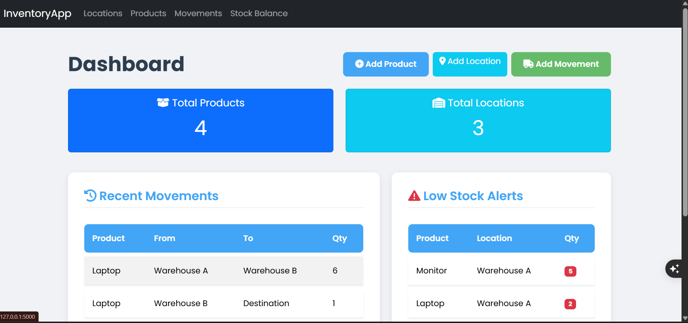

# Flask Inventory Management System

A comprehensive, full-stack Flask web application designed for efficient inventory management across multiple warehouse locations. This system provides a clean, responsive user interface for managing products, tracking stock movements, and generating real-time inventory reports. It is built with Flask and MongoDB, making it a robust and scalable solution for small to medium-sized businesses.

## Features

-   **Product Management**: Full CRUD (Create, Read, Update, Delete) functionality for products.
-   **Location Management**: Manage multiple warehouses or storage locations.
-   **Movement Tracking**: Track the movement of products between locations with timestamps.
-   **Dynamic Stock Reporting**: View real-time stock balances for each product at every location.
-   **Dashboard Overview**: An at-a-glance dashboard with key metrics like total products, total locations, and recent movements.
-   **Low Stock Alerts**: A dedicated section on the dashboard to highlight items running low on stock.
-   **Responsive UI**: Built with Bootstrap 5, the UI is fully responsive and works on all devices.

## Tech Stack

-   **Backend**: Flask, Flask-PyMongo
-   **Frontend**: HTML5, CSS3, Bootstrap 5, Jinja2
-   **Database**: MongoDB
-   **Python Libraries**: `pandas`, `openpyxl` for potential data import/export functionality.

## Project Structure

```
Flask-Inventory-Management-System/
├── .venv/
├── routes/
│   ├── __init__.py
│   ├── location_routes.py
│   ├── movement_routes.py
│   ├── product_routes.py
│   └── report_routes.py
├── static/
│   ├── css/
│   │   └── style.css
│   └── js/
│       └── script.js
├── templates/
│   ├── locations/
│   ├── movements/
│   ├── products/
│   ├── reports/
│   ├── index.html
│   ├── layout.html
│   └── navbar.html
├── .env
├── app.py
├── config.py
├── database_setup.py
├── extensions.py
├── models.py
└── requirements.txt
```

## Getting Started

Follow these instructions to get a copy of the project up and running on your local machine for development and testing purposes.

### Prerequisites

-   Python 3.x
-   MongoDB (a local instance or a cloud-hosted one like MongoDB Atlas)
-   Git

### Installation

1.  **Clone the repository:**
    ```bash
    git clone https://github.com/your-username/Flask-Inventory-Management-System.git
    cd Flask-Inventory-Management-System
    ```

2.  **Create and activate a virtual environment:**
    *On macOS/Linux:*
    ```bash
    python3 -m venv .venv
    source .venv/bin/activate
    ```
    *On Windows:*
    ```bash
    python -m venv .venv
    .venv\Scripts\activate
    ```

3.  **Install the dependencies:**
    ```bash
    pip install -r requirements.txt
    ```

### Configuration

1.  Create a `.env` file in the project root by copying the example:
    ```bash
    # You can just create a .env file manually
    ```

2.  Add your MongoDB connection string and a secret key to the `.env` file. 
    ```env
    MONGO_URI="mongodb://localhost:27017/inventory_db"
    SECRET_KEY="your-super-secret-key"
    ```

### Database Setup

Run the following command to populate the database with initial sample data:

```bash
python database_setup.py
```

## Usage

1.  **Run the application:**
    ```bash
    flask run
    ```

2.  Open your browser and navigate to `http://127.0.0.1:5000`.

## Screenshots


